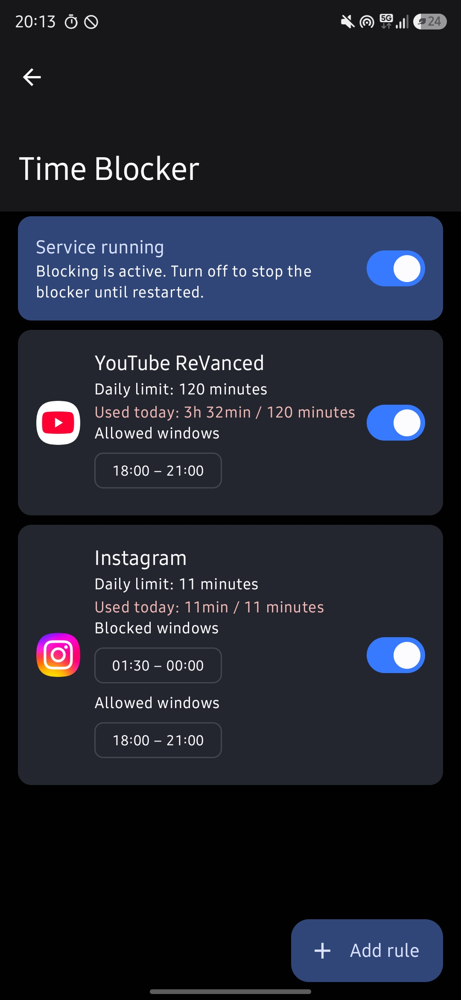
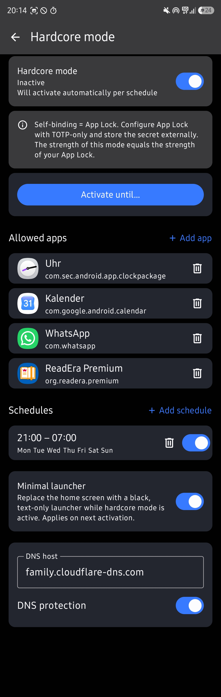
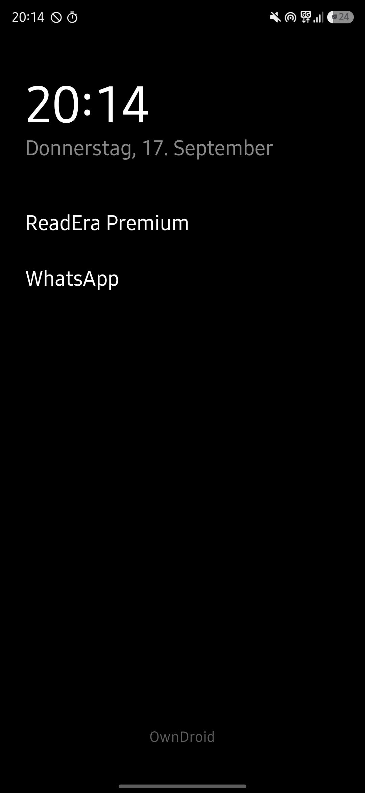
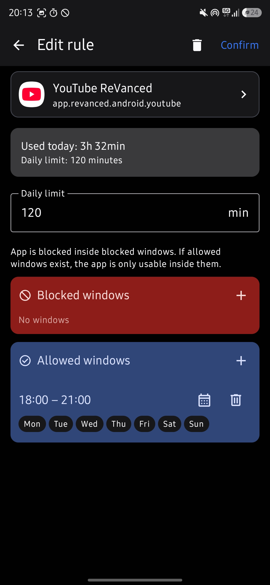
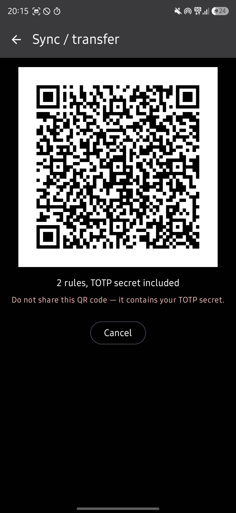

# OwnDroid

> **This is a fork** of [BinTianqi/OwnDroid](https://github.com/BinTianqi/OwnDroid) with additional features focused on **tamper-proof app and content blocking**. Submitted upstream: [#358 Time Blocker](https://github.com/BinTianqi/OwnDroid/pull/358), [#359 QR settings sync](https://github.com/BinTianqi/OwnDroid/pull/359). Hardcore Mode is fork-only for now.

<p>
  
  
  
</p>

Use Android's DevicePolicyManager API to manage your device.

## Why this fork

Most app blocker apps merely register as a *device administrator* to restrict app usage - but any user can simply deactivate that again in system settings. Even blockers advertising protection against this can often be tricked by hitting the deactivate button faster than the app can detect it and close the settings screen.

This fork uses **Device Owner** privileges instead, which cannot be revoked from system settings:

- **Time Blocker**: per-app daily usage limits and blocked/allowed time windows with per-weekday scheduling, enforced by suspending apps via `DevicePolicyManager`
- **Hardcore Mode**: lock the device down to an app allowlist, enforce content-filtering DNS, and optionally replace the home screen with a minimal launcher
- **TOTP-protected app lock**: block apps and hand the TOTP secret to another person - then you genuinely cannot unlock them yourself
- **QR settings sync**: transfer blocker rules and the TOTP secret between devices (e.g. phone → tablet) without any server or cloud

Combined with OwnDroid's existing Device Owner features, you can build a complete self-restriction setup that actually holds up:

- **Block uninstallation** of the apps that matter (including OwnDroid itself)
- Enforce **Always-on VPN** or **Private DNS** (e.g. a family-filter or ad-block DNS) to filter content network-wide - the user cannot switch them off
- Apply **user restrictions** (e.g. disallow installing apps) that stay in effect

## Fork features

### Time Blocker

Per-app screen-time rules enforced at the system level.

- **Daily limits** and **blocked/allowed time windows** per app, with per-weekday scheduling
- Enforcement via `DevicePolicyManager` app suspension - the app simply won't open, and there is no settings screen to outrun
- **Live usage display** per rule: wall-clock-based usage tracking that stays accurate even if the device clock was changed (UsageStats can't be trusted for this - see [tracking notes](AGENTS.md))
- Always-on foreground service with boot receiver: blocking survives reboots
- Overriding a rule requires unlocking the **App Lock** - with TOTP enabled and the secret held by someone else, you cannot cheat yourself



### Hardcore Mode

Maximum lockdown for focus periods: everything except a chosen allowlist stops working.

- **App allowlist**: while active, every app not on the list is suspended system-wide
- Activate **manually** (1 h / 2 h / 4 h / until 06:00 / custom end time) or via **schedules** (per-weekday time windows)
- The allowlist is **frozen while the mode is active** - no mid-session exceptions
- **DNS protection**: enforces a Private DNS hostname (default `family.cloudflare-dns.com`) for network-wide content filtering that cannot be switched off
- **Minimal launcher**: optionally replaces your home screen with a black, text-only launcher (clock/calendar only) while the mode is active
- Hardcore Mode protects OwnDroid itself via the App Lock - the strength of this mode equals the strength of your App Lock setup (use TOTP with an externally stored secret for real commitment)

### App Lock with TOTP

- Protects OwnDroid (and thereby both blocking features) with **password, biometrics, or TOTP**
- With **TOTP-only** configured and the secret handed to another person (or stored in an authenticator you don't control), you are genuinely locked out of your own rules

### QR settings sync

- Export **Time Blocker rules + TOTP secret** as a QR code, scan it on another device - rules and the lock travel together, no server or cloud involved
- Perfect for phone → tablet setups or restoring a config



> [!WARNING]
> The exported QR code contains your TOTP secret. Never share it with anyone who shouldn't be able to unlock your setup.

## Screenshots

Store screenshots live in `fastlane/metadata/android/en-US/images/phoneScreenshots/` (they are also picked up by F-Droid/IzzyOnDroid). When adding new ones:

| File | Screen | State to capture |
|---|---|---|
| `2.jpg` | Time Blocker overview | 2–3 rules with visible usage times, service toggle on |
| `3.jpg` | Time Blocker rule editor | daily limit + blocked windows + weekday chips visible |
| `4.jpg` | Hardcore Mode | active state, allowlist with apps, one schedule, DNS field |
| `5.jpg` | Minimal launcher | black text-only home screen |
| `6.jpg` | QR sync export | QR screen (**use a throwaway TOTP secret, never a real one!**) |

## Features (upstream)

- System: disable camera, disable screenshot, master volume mute, disable USB signal, lock task mode, wipe data...
- Network: add/modify/delete Wi-Fi, network stats, network logging, always-on VPN, private DNS...
- Applications: suspend/hide app, block app uninstallation, grant/revoke permissions, clear app storage, install/uninstall app...
- User restriction: disable SMS, disable outgoing call, disable bluetooth, disable NFC, disable USB file transfer, disable app installing/uninstalling...
- Users: user information, create/start/switch/stop/delete user...
- Password and keyguard: reset password, set screen timeout...

## Download

- [IzzyOnDroid F-Droid Repository](https://apt.izzysoft.de/fdroid/index/apk/com.bintianqi.owndroid)
- [Releases on GitHub](https://github.com/BinTianqi/OwnDroid/releases)

> [!NOTE]
> ColorOS users should download testkey version from releases on GitHub

## Working modes

- Device owner (recommended)

  Activating methods:
  - Shizuku
  - Dhizuku
  - Root
  - ADB shell command `dpm set-device-owner com.bintianqi.owndroid/.Receiver`
- [Dhizuku](https://github.com/iamr0s/Dhizuku)
- Work profile

## FAQ

### Already some accounts on the device

```text
java.lang.IllegalStateException: Not allowed to set the device owner because there are already some accounts on the device
```

Solutions: freeze the accounts' holder apps, or delete those accounts.

### Already several users on the device

```text
java.lang.IllegalStateException: Not allowed to set the device owner because there are already several users on the device
```

Solution: Delete secondary users, including work profile, private space and app cloning.

### Device owner is already set

```text
java.lang.IllegalStateException: Trying to set the device owner (com.bintianqi.owndroid/.Receiver), but device owner (xxx) is already set.
```

Only one device owner can exist on a device. Please deactivate the existing device owner first.

### MIUI & HyperOS

```text
java.lang.SecurityException: Neither user 2000 nor current process has android.permission.MANAGE_DEVICE_ADMINS.
```

Solutions:
- Enable `USB debugging (Security setting)` in developer options.
- Or execute activating command in root shell.

### ColorOS

```text
java.lang.IllegalStateException: Unexpected @ProvisioningPreCondition
```

Solution: Use OwnDroid testkey version

The testkey and signed versions differ only in their signatures. There is no functional difference between them.

### Samsung

```text
user limit reached
```

Samsung restricts Android's multiple users feature. There is currently no solution.

### Create work profile / user

On most devices, creating work profile is not allowed by the system when the device owner exist.
Because the system add `no_add_managed_profile` user restriction when a device owner is set.
Device owner can't modify user restrictions set by the system, but if your device is rooted, you can disable this restriction by executing the following commands in adb shell.
Note: the device owner and the work profile owner can't be the same app, or the device owner will lose its privilege during reboot.

```shell
pm set-user-restriction no_add_user 0
pm set-user-restriction no_add_managed_profile 0
pm set-user-restriction no_add_private_profile 0
pm set-user-restriction no_add_clone_profile 0
```

You should bypass the restrictions at your own risk. It may cause unexpected behavior, for example, the system may delete the user you created silently during reboot.

Some systems disable the feature of adding users in Android settings once a device owner is set.
You have to create users in OwnDroid. Or if you have root, run the above command in adb shell to remove that restriction.

## For advanced users

### API

OwnDroid provides an Intent-based API. You need to set the API key in settings and enable the API. The numbers in brackets represent the minimum Android version required.

- HIDE(package: String)
- UNHIDE(package: String)
- SUSPEND(package: String) (7)
- UNSUSPEND(package: String) (7)
- DISABLE_METERED_DATA(package: String) (9)
- ENABLE_METERED_DATA(package: String) (9)
- DISABLE_USER_CONTROL(package: String) (11)
- ENABLE_USER_CONTROL(package: String) (11)
- BLOCK_UNINSTALL(package: String)
- UNBLOCK_UNINSTALL(package: String)
- CLEAR_APP_STORAGE(package: String) () (9)
- ADD_USER_RESTRICTION(restriction: Boolean)
- CLEAR_USER_RESTRICTION(restriction: Boolean)
- SET_PERMISSION_DEFAULT(package: String, permission: String) (6)
- SET_PERMISSION_GRANTED(package: String, permission: String) (6)
- SET_PERMISSION_DENIED(package: String, permission: String) (6)
- SET_SCREEN_CAPTURE_DISABLED()
- SET_SCREEN_CAPTURE_ENABLED()
- SET_CAMERA_DISABLED()
- SET_CAMERA_ENABLED()
- SET_USB_DISABLED() (12)
- SET_USB_ENABLED() (12)
- LOCK()
- REBOOT() (7)

```shell
# An example of hiding app in ADB shell
am broadcast -a com.bintianqi.owndroid.action.HIDE -n com.bintianqi.owndroid/.ApiReceiver --es key abcdefg --es package com.example.app
```

```kotlin
// An example of hiding app in Kotlin
val intent = Intent("com.bintianqi.owndroid.action.HIDE")
    .setComponent(ComponentName("com.bintianqi.owndroid", "com.bintianqi.owndroid.ApiReceiver"))
    .putExtra("key", "abcdefg")
    .putExtra("package", "com.example.app")
context.sendBroadcast(intent)
```

[Available user restrictions](https://developer.android.com/reference/android/os/UserManager#constants_1)

## Build

You can use Gradle in command line to build OwnDroid.

```shell
# Use testkey for signing (default)
./gradlew build
# Use your custom .jks key for signing
./gradlew build -PStoreFile="/path/to/your/jks/file" -PStorePassword="YOUR_KEYSTORE_PASSWORD" -PKeyPassword="YOUR_KEY_PASSWORD" -PKeyAlias="YOUR_KEY_ALIAS"
```

(Use `./gradlew.bat` instead on Windows)

> [!NOTE]
> This fork also provides a Nix build environment (`shell.nix` / `flake.nix`) for hosts without a local JDK/Android SDK: `nix-shell --run "./gradlew assembleDebug"`.

## Contribute

Contributions are welcome!

1. [Fork](https://github.com/BinTianqi/OwnDroid/fork) this repository (deselect "Copy the master branch only", which is selected by default)
2. Clone your own repository using git (please use the `dev` branch)
3. Make changes (AI-assisted changes is allowed, but you have to ensure the quality)
4. Run the app on your device or emulator to test your changes (required for code contributions, optional for translation contributions)
5. Commit and push changes
6. Open a pull request in this repository

## License

[License.md](LICENSE.md)

> Copyright (C)  2026  BinTianqi
>
> This program is free software: you can redistribute it and/or modify it under the terms of the GNU General Public License as published by the Free Software Foundation, either version 3 of the License, or (at your option) any later version.
>
> This program is distributed in the hope that it will be useful, but WITHOUT ANY WARRANTY; without even the implied warranty of MERCHANTABILITY or FITNESS FOR A PARTICULAR PURPOSE.  See the GNU General Public License for more details.
>
> You should have received a copy of the GNU General Public License along with this program.  If not, see <https://www.gnu.org/licenses/>.
